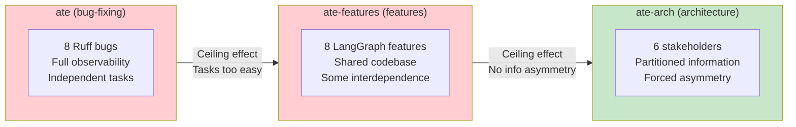

# Agent Teams Eval (ate-series)

An experimental series comparing Claude Code's **Agent Teams** feature
(symmetric peer agents) against its default mode (hub-and-spoke subagents)
across three software engineering task domains.

## Research Question

> For which software engineering tasks do symmetric peer agents outperform
> hub-and-spoke subagents — and what structural conditions must hold for the
> advantage to emerge?

## Motivation

Anthropic demonstrated that [teams of Claude instances can build a 100K-line C
compiler autonomously](https://www.anthropic.com/engineering/building-c-compiler).
This series asks: under what structural conditions do agent teams actually
outperform single agents — and when is it just parallelism?

## The Three Experiments

| | [ate](https://github.com/kar-ganap/ate) | [ate-features](https://github.com/kar-ganap/ate-features) | [ate-arch](https://github.com/kar-ganap/ate-arch) |
|---|---|---|---|
| **Task domain** | Bug triage & fix | Feature implementation | Architecture design |
| **Target codebase** | [Ruff](https://github.com/astral-sh/ruff) (Rust) | [LangGraph](https://github.com/langchain-ai/langgraph) (Python) | Simulated stakeholders (LLM-backed) |
| **Treatments** | 8 (3 executed) | 11 (3 executed) | 2 architectures x 2 partitions |
| **Runs** | 24 | 3 | 32 |
| **Agent model** | Claude Opus 4.6 | Claude Opus 4.6 | Claude Opus 4.6 |
| **Key metric** | Fix rate (8 bugs) | Acceptance tests (104) | 4-layer rubric composite |
| **Result** | Ceiling (8/8 all treatments) | Ceiling (104/104 all treatments) | **Significant** (p=0.014, d=+0.99) |
| **Peer communication** | Zero | Zero | Zero |
| **Speedup** | 5.2x | 3.6x | N/A (quality focus) |
| **Findings** | [findings.md](https://github.com/kar-ganap/ate/blob/main/docs/findings.md) | [findings.md](https://github.com/kar-ganap/ate-features/blob/main/docs/findings.md) | [findings.md](https://github.com/kar-ganap/ate-arch/blob/main/docs/findings.md) |

## Progression

Each experiment was designed to address the failures of its predecessor:
- **ate** failed because bug-fixing is structurally biased toward solo agents —
  each bug is independently solvable with full codebase access.
- **ate-features** failed because feature implementation with a shared codebase
  still allows each agent to solve its task independently — no information
  dependency between agents.
- **ate-arch** succeeded by *constructing* information asymmetry: stakeholder
  constraints are partitioned between agents, and cross-partition conflicts
  require cross-agent information to resolve optimally.

## Key Findings Across the Series

### 1. Agent Teams is a parallelism engine, not a collaboration tool
All three experiments found **zero peer-to-peer communication** despite Agent
Teams enabling the `SendMessage` primitive. Agents never initiate lateral
messages to peers. All coordination flows through the lead agent (coordinator →
agent), making Agent Teams functionally identical to hub-and-spoke for
communication patterns.

### 2. Ceiling effects mask treatment differences on easy tasks
Bug-fixing and feature implementation tasks that Claude Opus 4.6 can solve
independently in <30 minutes show no quality difference between treatments.
The model's capability frontier must be exceeded for architectural differences
to matter.

### 3. Information asymmetry is the key structural condition
The ate-arch experiment structured information asymmetry by construction (each
agent interviews only its assigned stakeholders). This is the only condition
across all three experiments that produced a significant treatment effect
(d = +0.99, p = 0.014).

### 4. The advantage scales with cross-partition dependency
When 75% of conflicts span the agent boundary (Partition C), the treatment
effect on L3 resolution quality is 3.5x larger than when only 25% of conflicts
cross the boundary (Partition A). This dose-response gradient supports the
causal mechanism: peers benefit from complementary information, not just from
being peers.

### 5. Agent Teams adds real wall-clock speedup
Even without quality improvement, Agent Teams consistently reduces wall-clock
time: 5.2x for bug-fixing, 3.6x for feature implementation. For tasks within
the model's capability frontier, parallelism alone justifies Agent Teams.

## Methodology

All three experiments share:
- **TDD discipline**: Tests before code, validation gates (make test/lint/typecheck)
- **Phase lifecycle**: PLAN → TEST → IMPLEMENT → RETRO per phase
- **Immutable principles**: Documented in each project's `docs/desiderata.md`
- **North star design**: `docs/experiment-design.md` in each repo
- **Raw data preservation**: Transcripts and scores committed, never modified
- **Python + uv**: Pydantic models, Typer CLI, pytest, ruff, mypy strict

## Built On

- [Claude Code](https://docs.anthropic.com/en/docs/claude-code/overview) — agentic coding tool
- [Agent Teams & Subagents](https://docs.anthropic.com/en/docs/claude-code/sub-agents) — the multi-agent infrastructure under study

## Repository Links

| Repo | Description | Status |
|------|-------------|--------|
| [ate](https://github.com/kar-ganap/ate) | Bug-fixing on Ruff | Round 1 complete, Round 2 screening |
| [ate-features](https://github.com/kar-ganap/ate-features) | Feature implementation on LangGraph | Phase 5 complete |
| [ate-arch](https://github.com/kar-ganap/ate-arch) | Architecture design with stakeholders | Phase 7 complete |
